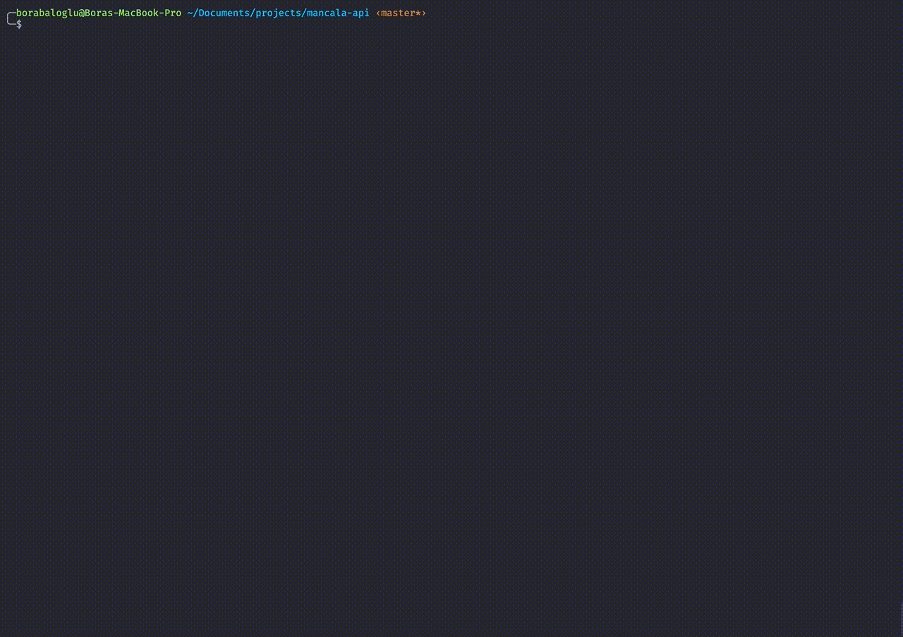

# Mancala API



## Overview

Each of the two players has six pits in front of him/her. To the right of the six pits, each player has a larger pit, his Mancala or house.

At the start of the game, six stones are put in each pit. The player who begins picks up all the stones in any of their own pits, and sows the stones on to the right, one in each of the following pits, including his own Mancala. No stones are put in the opponent's' Mancala. If the players last stone lands in his own Mancala, he gets another turn. This can be repeated any number of times before it's the other player's turn. When the last stone lands in an own empty pit, the player captures this stone and all stones in the opposite pit (the other players' pit) and puts them in his own Mancala.

The game is over as soon as one of the sides run out of stones. The player who still has stones in his/her pits keeps them and puts them in his/hers Mancala. The winner of the game is the player who has the most stones in his Mancala.

## Tech Stack

- [ExpressJS](https://expressjs.com)
- [MongoDB](https://www.mongodb.com) + [Mongoose](https://mongoosejs.com)

## Project Structure

- dist: Includes compiled project
- logs: Includes log files
- scripts
  - play.ts: A basic CLI to play game by using mancala API
- src
  - database
    - connection.ts: Makes database connection
  - modules: Includes modules
    - [module-name]: Includes all module files like controllers, services etc.
      - dto: Includes data transfer objects
      - interfaces: Includes interfaces of module
      - models: Includes models of module
      - [module-name].controller.ts: Implements routes
      - [module-name].helper.ts: Helper functions for the module
      - [module-name].service.ts: Services that will be used by controller
  - shared
    - configs: Includes configuration files
    - errors: Includes custom error class implementations
    - exception-filters: Includes custom error handlers that will be used by express
    - loggers: Includes loggers
    - middlewares: Includes middlewares that will be used by routes
  - app.ts: Creates and exports express application
  - main.ts: Starts express application

## Installation Guide

### Prerequisties

- NodeJS (12 >=)
- MongoDB (4 >=) (Required if local database will be used)

### 1. Clone repository

```bash
$ git clone https://github.com/borabaloglu/mancala-api.git
```

### 2. Install dependencies

```bash
$ cd mancala-api
$ npm i
```

### 3. Create env file

#### For development

Rename **.example.env** file to **.dev.env** and replace the variables if needed.

#### For production

Rename **.example.env** file to **.env** and replace the variables if needed.

#### For play

Rename **.example.play.env** file to **.play.env** and replace the variables if needed.

### 4. Build

```bash
$ npm run build
```

### 5. Run

#### For development

```bash
$ npm run start:dev
```

> If you want hot reload run, hot reload only works in **development** mode

```bash
$ npm run start:watch
```

#### For production

```bash
$ npm run start:prod
```

### 6. Play

**Note: Server must be running if play script will use localhost as base url.**

```bash
$ npm run play
```
